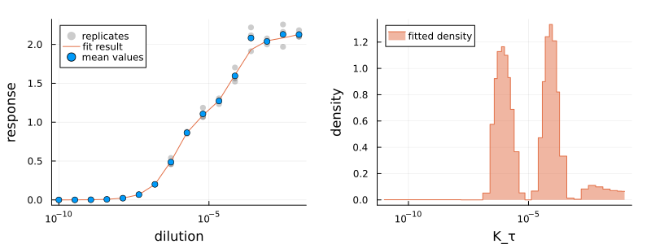

# AntibodyPackages


[](https://antibodypackages.github.io/AntibodyMethodsDoseResponse-documentation/)
[](https://antibodypackages.github.io/AdaptiveDensityApproximation-documentation/)
[](https://antibodypackages.github.io/FittingObjectiveFunctions-documentation/)


## About

**AntibodyPackages** contains [Julia](https://julialang.org/) packages for the analysis of (antibody) dose-response curves: 



For further details see the corresponding paper ([https://arxiv.org/abs/2407.06052](https://arxiv.org/abs/2407.06052)). In addition, the packages [`FittingObjectiveFunctions`](https://github.com/AntibodyPackages/FittingObjectiveFunctions) and [`AdaptiveDensityApproximation`](https://github.com/AntibodyPackages/AdaptiveDensityApproximation) may be of interest for general scientific projects.

The packages were originally developed and are currently maintained by [Dominik Tschimmel](https://dominiktschimmel.github.io/) ([GitHub](https://github.com/DominikTschimmel)).


## Installation

Open the [Julia](https://julialang.org/) repl and press `]` to enter the package manger.

```julia

               _
   _       _ _(_)_     |  Documentation: https://docs.julialang.org
  (_)     | (_) (_)    |
   _ _   _| |_  __ _   |  Type "?" for help, "]?" for Pkg help.
  | | | | | | |/ _` |  |
  | | |_| | | | (_| |  |  Version ****
 _/ |\__'_|_|_|\__'_|  |  Official https://julialang.org/ release
|__/                   |


pkg>
```

First, add the official registry (if not done already):

```julia
pkg> registry add General
```

Next, add the `AntibodyPackagesRegistry`:

```julia
pkg> registry add https://github.com/AntibodyPackages/AntibodyPackagesRegistry
```

Finally, add the packages that you want to install. E.g. `AntibodyMethodsDoseResponseConvenience`, which installs all necessary dependencies:

```julia
pkg> add AntibodyMethodsDoseResponseConvenience
```


### List of packages

| Package | Short Description |
| :------: | :-------- |
| [`FittingObjectiveFunctions`](https://github.com/AntibodyPackages/FittingObjectiveFunctions) | Dependency-free package to construct fitting objective functions from (measurement) data. |
| [`AdaptiveDensityApproximation`](https://github.com/AntibodyPackages/AdaptiveDensityApproximation) | Approximate density functions with discrete grids that can be refined adaptively. Contains additional calculation methods for grids (e.g. numerical integration). |
| [`AntibodyMethodsDoseResponseRecipes`](https://github.com/AntibodyPackages/AdaptiveDensityApproximationRecipes) | [`Plots`](https://docs.juliaplots.org/stable/) recipes for the visualization of grids. |
| [`AntibodyMethodsDoseResponseConvenience`](https://github.com/AntibodyPackages/AntibodyMethodsDoseResponseConvenience) | Convenience package for the analysis of dose-response curves. Contains predefined analysis and plotting methods. |
| [`AntibodyMethodsDoseResponse`](https://github.com/AntibodyPackages/AntibodyMethodsDoseResponse) | Minimal package for the analysis of dose-response curves. Intended for the development of analysis methods from scratch. Requires fewer dependencies. |
| [`AntibodyMethodsDoseResponseRecipes`](https://github.com/AntibodyPackages/AntibodyMethodsDoseResponseRecipes) |  [`Plots`](https://docs.juliaplots.org/stable/) recipes for `AntibodyMethodsDoseResponse` objects. |


## License

All packages are provided under MIT License (Expat). If you want to cite the packages in a scientific context, you might also want to cite the corresponding [paper](https://arxiv.org/abs/2407.06052).